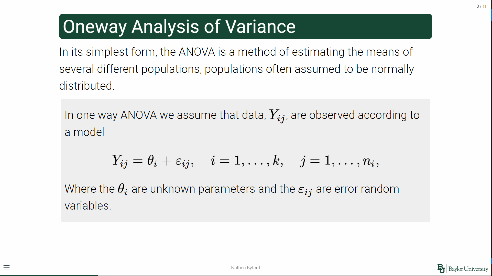

# quarto-presentation-tips
Reference of tips and tricks for making quarto revealjs presentations.

## Template and formatting
Use the template from [Baylor Theme](https://github.com/nathenbyford/baylor_theme) to keep it consistent and get the added benefits of my `def` object.

The quarto presentations revealjs guide is a good start [here](https://quarto.org/docs/presentations/revealjs/), but this is a quick reference for things I need more often, or I find cool.

**Columns**, to make columns on a slide I use 
```{java}
::::columns
:::{.column width=50%}
Column 1
:::
:::{.column width=50%}
Column 2
:::
::::
```
This code will make two columns on the slide with each being half the slides' width. This could be altered to be any percentage of the slide that is less than or equal to 100% when added. You can also make 3 or more columns if needed, following the same sum to 100 rule.

**Footnotes**, to make a footnote there are two ways. One way will number it and add a reference, and the other will just have a footnote at the bottom of the page.

```
This is something cool[^1]. Here is something else[^2]

[^1]: Where did this cool thing come from.
[^2]: Another reference.
```

```
:::aside
Note: this is something cool
:::
```


If the text on the slide is too large, and you cannot fit all the contents on one slide you can try making the slide contents smaller. This will just make all text and math on a slide smaller to fit more.
```
## New slide {.smaller}
Slide contents
```

## Template specific formatting
If you are using the Baylor theme I've created, there is a new object I like to use on slides to emphasize specific parts. This is my `.def` tag, it's a gray box with rounded edges that will surround the content within. Here's an example of how it looks 
To use the tag just put the contents inside
```
:::def
Important stuff
:::
```

## Sharing and Distribution

To include all the required elements for the theme and presentation in the yaml header just include `embed-resources: true`. This would look something like the yaml shown below.

```
---
title: 'Something cool'
author: 'Me'
format: revealjs
embed-resources: true
---
```